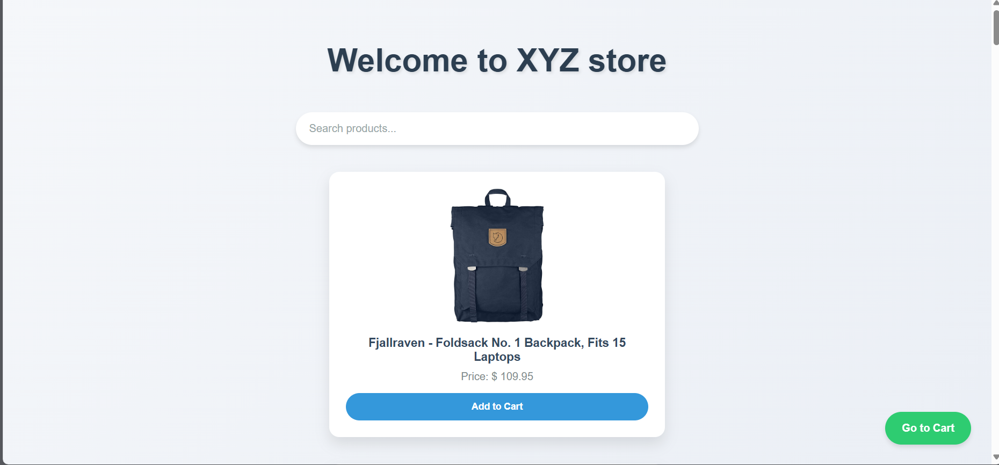

# Store - Nuxt 3 E-commerce Application


## Key Pages

### Home Page (Index)



The home page serves as the main landing page for our e-commerce store. It features:

- A clean, modern design showcasing featured products
- A responsive grid layout for product listings
- Search functionality to help users find specific items
- Filtering options for product categories
- Add to cart buttons for quick shopping

The design focuses on user-friendly navigation and attractive product presentation to engage visitors and encourage exploration of the store's offerings.

### Shopping Cart Page


The shopping cart page provides a comprehensive overview of the user's selected items:

- Detailed list of products added to the cart
- Product images, names, quantities, and individual prices
- Total price calculation for all items in the cart
- Options to update quantities or remove items
- A clear call-to-action button to proceed to checkout

This page is designed to give users full control over their selections before proceeding to purchase.

### Checkout Page


The checkout page streamlines the purchasing process:

- Summary of cart contents
- Form for shipping information
- Options for selecting shipping method
- Payment method selection
- Order total with breakdown (subtotal, shipping, taxes)
- Clear and prominent 'Place Order' button

The checkout process is designed to be straightforward and secure, ensuring a smooth transaction experience for the user.

## Overview

This project is a practice e-commerce store built using the Nuxt 3 framework. It serves as an excellent learning resource for beginners who are exploring Nuxt.js and want to understand how to integrate API calls into their applications.

Live Demo: [https://fakestoreee.netlify.app/](https://fakestoreee.netlify.app/)

## Features

- Product listing
- Shopping cart functionality
- Search functionality
- Responsive design
- API integration

## Technologies Used

- Nuxt 3
- Vue.js 3
- TypeScript
- Java script
- Local storage

## Project Structure

The project follows the standard Nuxt 3 directory structure:

- `components/`: Contains reusable Vue components
- `layouts/`: Defines the overall structure of pages
- `pages/`: Contains the main views of the application
- `plugins/`: Includes Vue plugins and other JavaScript modules
- `public/`: Stores static assets
- `server/`: Contains server-side logic (if any)

## Setup and Installation

1. Clone the repository:
   ```
   git clone https://github.com/Abdulmehad/Store.git
   cd Store
   ```

2. Install dependencies:
   ```
   npm install
   # or
   yarn install
   # or
   pnpm install
   ```

3. Run the development server:
   ```
   npm run dev
   # or
   yarn dev
   # or
   pnpm dev
   ```

4. Open [http://localhost:3000](http://localhost:3000) in your browser.

## Building for Production

To create a production version of your app:

```
npm run build
```

You can preview the production build with `npm run preview`.

## Components

The `components/` directory likely includes reusable UI elements such as:

- ProductCard: Displays individual product information
- SearchBar: Allows users to search for products
- ShoppingCart: Manages the user's selected items
- Navbar: Navigation component for the application

## Layouts

The `layouts/` directory may contain:

- default.vue: The main layout wrapper for pages
- error.vue: Custom error page layout

## Pages

The `pages/` directory probably includes:

- index.vue: Home page with product listings
- product/[id].vue: Individual product details page
- cart.vue: Shopping cart page
- checkout.vue: Checkout process page

## API Integration

This project demonstrates how to make API calls in a Nuxt 3 application. It likely uses the `useFetch` composable or `$fetch` utility provided by Nuxt to interact with an external API (possibly [Fake Store API](https://fakestoreapi.com/)).

## State Management

While not explicitly mentioned, the project may use Pinia for state management, which is common in Nuxt 3 applications. This would handle global states like the shopping cart and user preferences.

## Styling

The project appears to use CSS for styling, providing a responsive and customizable design system.

## Deployment

The application is deployed on Netlify, showcasing how to host a Nuxt 3 application on a static hosting platform.

## Learning Outcomes

By working on this project, developers can learn:

- Setting up a Nuxt 3 project
- Creating and organizing components in Vue 3
- Implementing routing in Nuxt 3
- Making API calls and handling asynchronous data
- State management in a Vue/Nuxt application
- Responsive design implementation
- Deploying a Nuxt application

## Contributing

Contributions are welcome! Please feel free to submit a Pull Request.

## License

This project is open source and available under the [MIT License](LICENSE).

```

This README provides a comprehensive overview of the project, its structure, setup instructions, and the key concepts it covers. It's designed to give both contributors and learners a clear understanding of the project's scope and the technologies involved.
